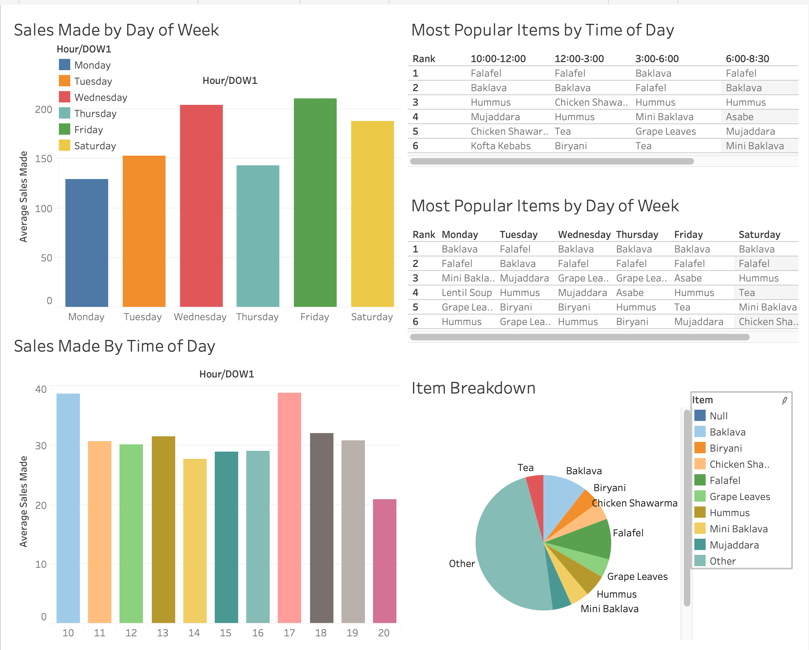

# Havenly Treats Data Solutions
Mehika Patel

## Abstract
The goal of this project was to lay out a preliminary analysis of Havenly's sales data, while scoping out a future data solution for the company. This scoping includes an impact hypothesis, a solution path, and risks and assumptions. The data pulled for preliminary analysis was from the restaurant's shopify and squareup accounts, accounts they use for online and in person orders. I provide the results of a preliminary analysis in tableau to display what kind of basic level analysis could eventually be used to conduct more complex analysis, that can be used to increase sales. 

## Design
This project is based in Havenly's sales data, as well as general small business analysis. The data was pulled from shpify and squareup. The design is to effectively communicate potentials for data work at the organization and to provide specific possible project scoping for Havenly.

## Data
The dataset contains around 5,100 sales data points, ranging from last July to the second to last week of April. The data includes many items that can be useful for future market basket analysis. However, for the initial report, only time of transaction, item sold, and net sale were used.

## Algorithms

For this intial report, basic EDA was used to pull several points of information, detailed in the tableau dashboard. For future work, I propose a market basket analysis, or affinity analysis, in which an algorithm is used to identify joint sales occurence in products sold. This is then used to improve marketing strategies and promotion strategies. A big assumption of this analysis is that joint occurence in sales necessarily means the items frequently sold are complementary. If items are not complementary, it may not be appropriate business strategy to attempt joint promotions or marketing. 

## Tools
- Excel for data manipulation
- Tableau for dashboard building
- Google Slides for presentation

## Communication
In addition to the slides and visuals presented, I plan to embed my tableau dashboard to the eventual email I will send to Havenly.

