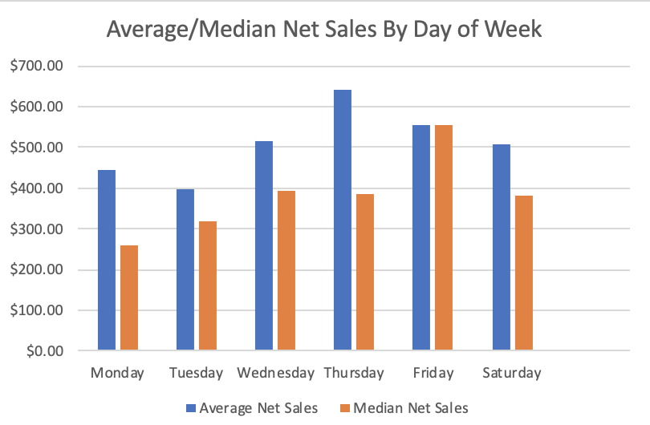

The following displays a breakdown of average or median net sales sorted by various time partitions, including day of week and time of day. Median was selected over average for some measures to control for outliers. These values were calculated with data from July 2020 to Present Day. It seems according to our data, that Fridays are the most popular day for Havenly, with Mondays and Tuesdays being lower profit days. 

